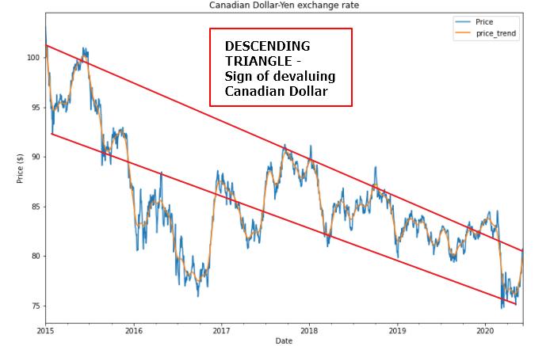
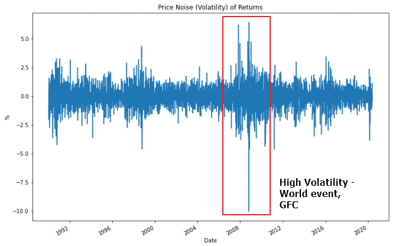
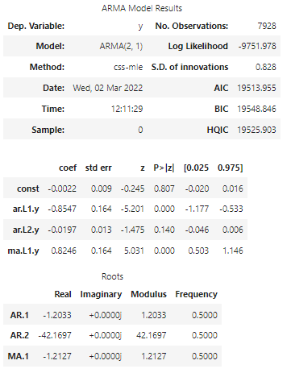
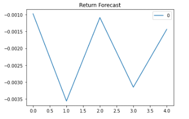
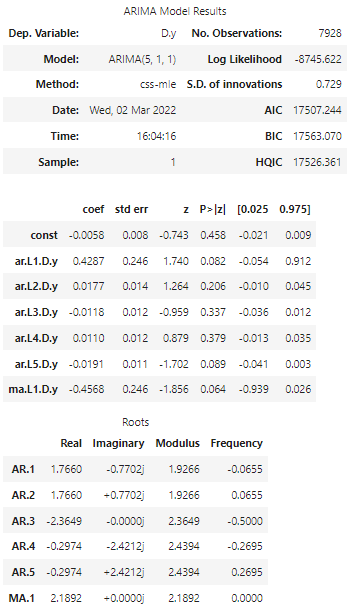
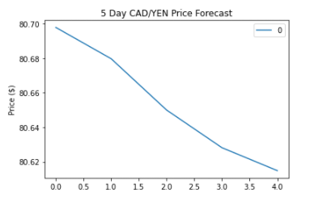
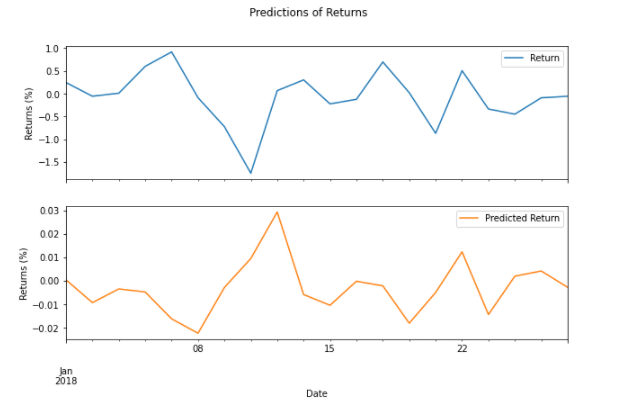
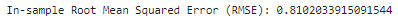
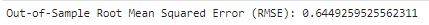

# Fintech-TimeSeries

# A Yen for the Future

## Background

This repository inludes a time series analysis and regression analysis of the Canadian Dollar and Yen exchange rates.

Below are the links to the code files and data set and below that is the overview and analysis of the data.

### Files

[Time-Series Starter Notebook](Code/time_series_analysis.ipynb)

[Linear Regression Starter Notebook](Code/regression_analysis.ipynb)

[CAD/JPY Data CSV File](Code/cad_jpy.csv)

- - -

# Overview/Analysis

## 1. Decreasing Canadian Strength

The analysis showed that the Canadian dollar could purchase less and less Yen over time. This indicates that the Japanese economy has strengthened in the last 20 years compared to the Canadian dollar, causing a better exchange rate for the Yen.

Furthermore, the price noise calculation shows high volatility in the exchange rate with a few periods of extremely high volatility due to global crises, indicating instability in price action.

## 2. What does the Future Hold?

Forcasting returns using the ARMA model shows us the predicted returns based off past returns. As we can see the Canadian dollar has been steadily purchasing less YEN per its dollar and thus the returns y value is negative.

Furthermore, the ARIMA model shows us a descending price value, highlighting a continued drop in value of the Canadian dollar compared to the Yen.

## 3. The Final Frontier

Linear regression models predicts the future exchange rate. Utilising lagged returns and testing data we can plot the computers prediction in a linear regression model.

Furthermore, the results of the in sample and out of sample data shows the variance and which dataset is better to use for predictions. The lower the variance the higher the accuracy. Turns out that the out of sample data has higher accuracy.

# Conclusion

**Question:** Do you see any patterns, long-term and/or short?  
**Answer:** The Canadian Dollar-Yen exchange rate is in a downward trend, slowly decreasing over time with slight corrections to the upside but followed by further drops in price.

**Question:** Based on the p-value, is the model a good fit?  
**Answer:** This model shows the voltility of the returns in a linear spiked fashion and therefore is a good fit.

**Question:** What does the model forecast will happen to the Japanese Yen in the near term?  
**Answer:** The model forcasts that the price of Yen will increase in the near term.

**Question:** What does the model forecast will happen to volatility in the near term?  
**Answer:** The model forcast shows us the Yen will continue to increase in value and experience volatility.

**Question:** Does this model perform better or worse on out-of-sample data as compared to in-sample data?  
**Answer:** The out-of-sample data performs better has the mean squared error is less than the in-sample data, 0.644 vs 0.810. The lower the score the higher the accuracy is. Therefore the out-of-sample data is the winner in this scenario.

### Conclusion Analysis

1. Based on your time series analysis, would you buy the yen now?

The time series analysis shows the Yen will increase in value over time, therefore it is a good time to buy now.
    
2. Is the risk of the yen expected to increase or decrease?

The risk of yen is expected to decrease due to its strength and stability, as compared to the Canadian dollar.
    
3. Based on the model evaluation, would you feel confident in using these models for trading?

Yes, these models make it clear on potential directions of price of an asset and therefore would be good in making profitable trades in the market.
  
- - -

